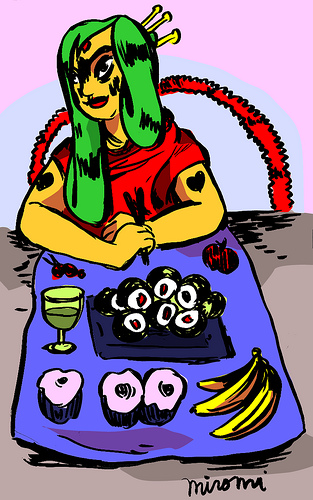

# Romy's Programming Cookbook

Tasty iOS recipes, learning from the masters
and swirling up some nice new pastries, cookies,
salads, and tofu tasties.

## Why?

It's important to get as many different ways of doing things
as possible in one place for me. There are many ways to handle Core Data, and I want to collect them here so that I can tweak them for my needs.

